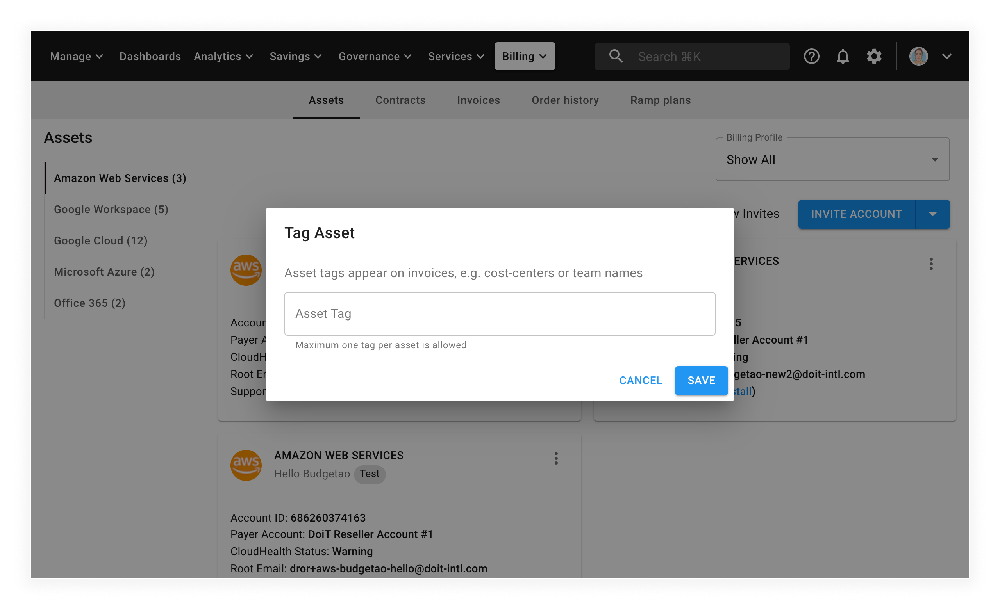

# Tag Assets

Assets in DoiT Cloud Management Platform (CMP) refer to your Billing Accounts for Google Cloud, Accounts for AWS, or Subscriptions for Google Workspace, Microsoft Azure, or Office.

You can tag an asset for classification purposes. Tags will appear on invoices so you will be able to identify invoice items easier. The best practice is to tag assets with a term or keyword like team name, cost center, location, or any tagging convention used in your organization.

Note that only one tag is allowed per asset. To add tags to assets, see the following instructions.



Required Role: **Admin**



1. Navigate to the _Assets_ page via the _Billing_ menu from the top navigation bar
2. From the _Assets_ page, select the asset type from the left-hand menu (_Amazon Web Services_, _Google Workspace_, and so on)
3. After finding the asset you want to tag, select the three dots icon in the top right-hand corner of the asset card
4. Select _Tag Asset_ from the drop-down menu:

   

   The CMP will open a new modal dialog:

   

5. Input a new tag or select from the list of previously created tags
6. Select _Save_

After selecting _Save_, the tag will be visible under the asset name in the form of a grey chip.

All new tags you save will be added to the global tag list and will be available for use with other assets.
