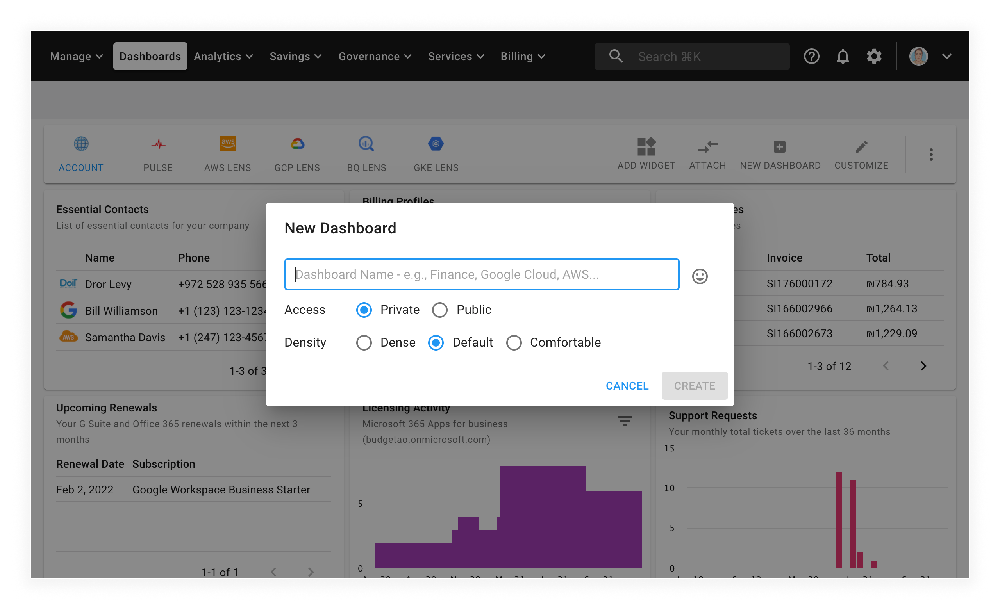
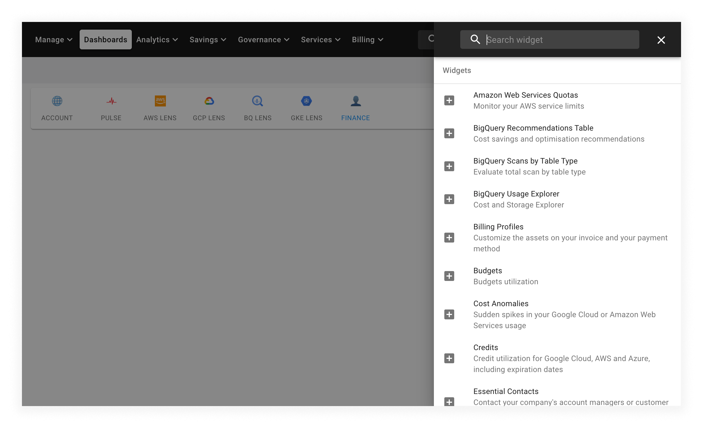
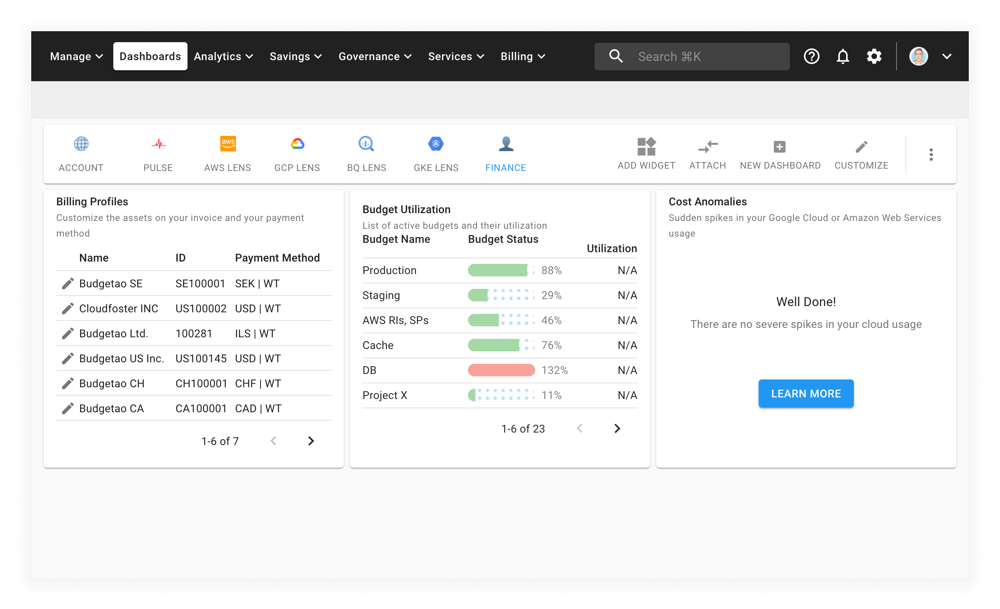

# Create New Dashboard

You can maintain multiple dashboards in your Cloud Management Platform to visualize metrics, manage licenses, and access essential data for your organization.

Start from an existing dashboard:

Select the _New Dashboard_ button from the right-hand side of the dashboard navigation bar:

Choose a name that suits your use-case (e.g., "Finance", "Google Cloud", "AWS", and so on).

Every dashboard can be _Private_ or _Public_:

* Private &mdash; only you can view the dashboard
* Public &mdash; any user in your organization can access this dashboard

If you select _Public_, you will be given the option to allow other people in your organization to edit the dashboard.

The _Density_ determines the layout of the dashboard (with more dense dashboards having smaller widgets but more display space, and vice-versa).

Select _Create_ to create your new dashboard.

The CMP will create your new dashboard and take you to the new dashboard page.

## Add widgets

Once a dashboard has been created, you can add widgets by selecting the _Add Widget_ button from the right-hand side of the dashboard navigation bar.

Selecting _Add Widget_ will slide open the widgets panel:

Select the plus icon next to the widget you want to add to your dashboard.

This example shows a dashboard named "Finance" with three finance-related widgets:

## Edit widgets

To edit widgets, select _Customize_ from the right-hand side of the dashboard navigation bar.

After selecting _Customize_, two icons will appear in the top right-hand corner of each widget. The first icon (two columns of three dots) allows you to drag widgets around and rearrange the dashboard. The second icon (a trash can) allows you to remove the widget from the dashboard.

When you are finished editing the dashboard, select _Done_ from the right-hand side of the dashboard navigation bar to save your changes.



See also: [Accessing a public dashboard](accessing-a-public-dashboard.md)


