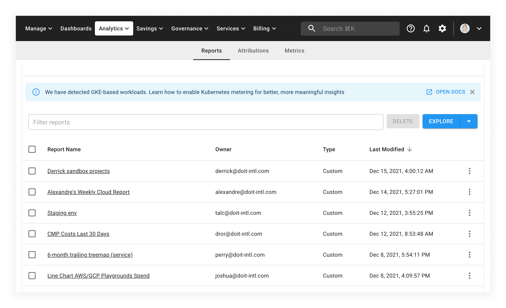

# Clone Cloud Analytics Reports

For cases in which you'll want to create a copy of an existing Cloud Report, you have the option to either:

* Clone the report
* Customize the report

Let's go over the differences, and how to perform each action.

## Clone Reports

The _Clone_ function is available for all Cloud Reports, whether you created it or a colleague did. When you clone a report, you create a new version of it and can make whatever changes you'd like without affecting the report the cloned version is based on.

To clone a report, open a report and select the _Clone Report_ icon (two stacked documents) from the right-hand menu:

When you clone a report, a new report will appear with the name "A copy of
_ORIGINAL REPORT NAME_". From there, you can edit the report's name and
make adjustments.

## Customize Reports

The "Customize" function is available for Preset Reports only. These are built-in reports you have access to right away before creating any reports yourself. This function allows you to create a copy of a Preset Report and make modifications on top of it.

To identify a Preset Report, look under the _Type_ column for the word "Preset".

Load up the report, then select the _Customize_ icon (two stacked documents) from the right-hand menu. This will, essentially, duplicate the report for you.

The new report will be created the name "A copy of _ORIGINAL PRESET REPORT NAME_". From there, you can edit the report's name and make modifications.
