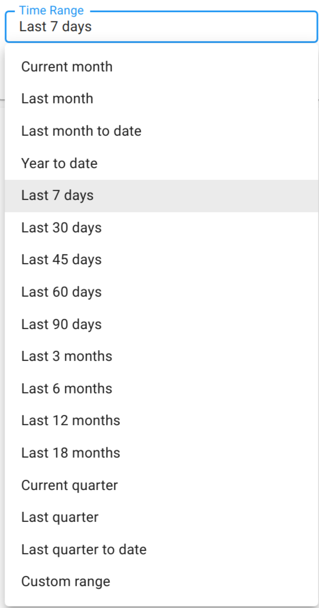
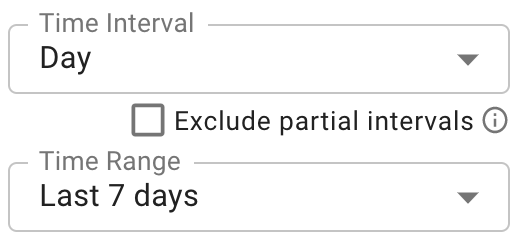
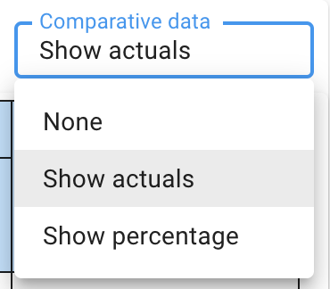
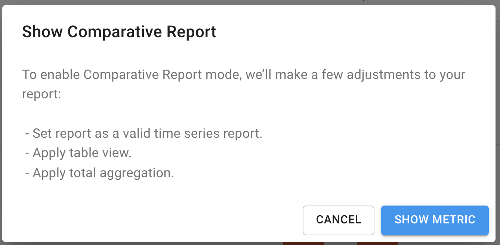
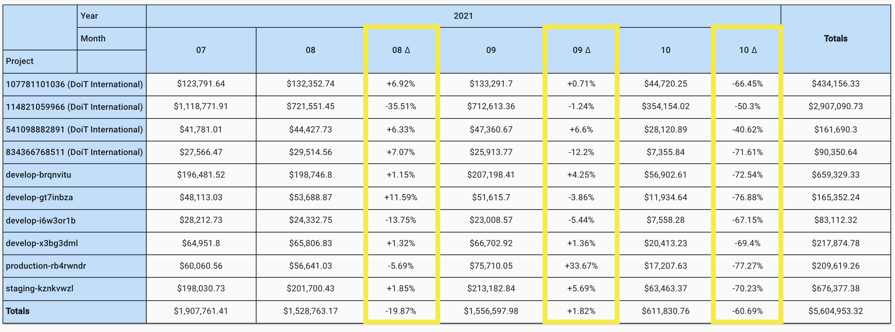
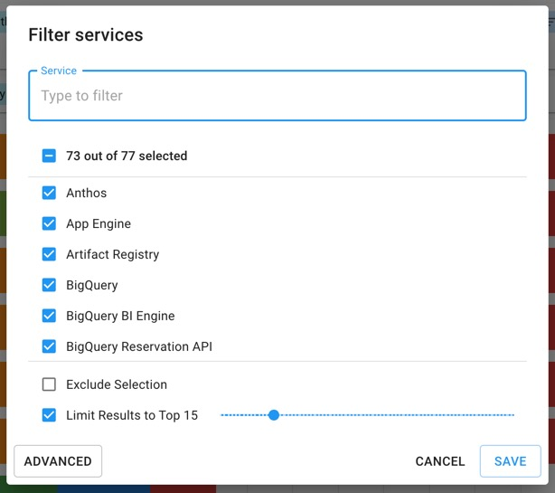

# Edit Cloud Analytics Report



If you're new to Cloud Reports and/or haven't created a Cloud Report yet, we recommend reading our post on [_**Creating Cloud Reports**_](create-cloud-report/) before reading further.



An example cloud analytics report:

There are several types of edits you can make to a report like this:

* Adding additional dimensions
* Changing the metric by which your dimensions are being measured
* Reordering results
* Changing the visualization
* Modifying the time interval and/or range
* Filtering dimensions

Most of these are self-explanatory, as you would simply make your changes the same way you made your original selection.

## Report Settings

### Metrics

**Cost:** Analyze your reports on a basis of how much your selected dimensions cost you.

**Usage**: Analyze your reports and selected dimensions on a usage basis. Make sure to pair this with the Unit chip as a Breakdown Dimension.

**Savings:** Analyze your reports and selected dimensions on a savings basis. These savings come as a result of your commercial agreement with Google Cloud and the agreed-upon discount between your company and DoiT International.



The discount is not available for the following services: Google Maps APIs, Google Support, Looker, Preemptible VMs (compute engine), 3rd party GCP Marketplace services, Premium OS Images.



### Aggregation

Use aggregations to summarize how you view your reports. [Read more on aggregations](https://help.doit-intl.com/cloud-analytics/using-aggregations-in-cloud-reports).

### View As

This is where you select how your report is visualized.

### ML Features

Use this to perform advanced analysis in your reports with just a click. Use this to perform [Trend Analysis](https://help.doit-intl.com/cloud-analytics/trend-analysis) or to [create Forecasts](https://help.doit-intl.com/cloud-analytics/forecasting) is supported.

### Time Interval & Time range

Specify the frequency in which data is aggregated. For the time interval, you have the following options: Hour, Day, Week, Month, Quarter, Year.

For the time range, the options are the following:

### Exclude partial Intervals

When looking at at a report the most current interval is always incomplete. If the report is **Daily** then the current day will always be collecting billing data throughout the day. By checking this checkbox, cloud analytics will remove any incomplete time interval from the data of the report.

This means that we will hide data for the current day for daily intervals, current week for monthly intervals, etc.

This can be very useful when performing comparative reports like Month over Month analysis, or Week over Week analysis. This feature can also be used to remove outliers to help the accuracy of our heatmap views since partial intervals tend to skew trends by representing incomplete periods.

### Timezone

Timezone used to aggregate the time interval in your report.



Google invoices are shown in PST

Amazon invoices are shown in UTC

_If you modify your timezone to reflect your local or company time, the totals will not reflect the invoices._



### Currency

Currency that the billing data is reported in (Metric must be "Cost").

### Compare Data

The **Compare Data** dropdown will automatically add either **% change** or **actual difference** between 2 time intervals in a report.

To enable Comparison mode select either **Show actuals** or **Show percentage** from the _Comparative data_ drop-down in Edit mode of Cloud Analytics Reports

Comparison mode is

* Only supported on _Table_ based views.
* Only supported with _Total Aggregation_
* Must be used on _Time series data_

When selected _**we will automatically adjust your report**_, you will be warned of the changes and asked to confirm.

Once enabled, you will see new columns in your table based view showing the &#x2206; between time intervals. This difference (&#x2206;) appears **after** the intervals compared.

For example below: Months 07 (July) and 08 (August) show the % change after in the column &#x2206;08 (Change to August)

_Note: Column headings will contain a % symbol when showing % change_

### Filtering Values

You can filter the metric included in the report by using an [Metric Filter](metric-filters.md)

To view a subset of your dimension's values, click on the chip you'd like to filter. Then check the boxes next to the subsets you'd like to view in the report.

You may also exclude a selection of values, or limit results to a specific number of values arranged in descending order according to the Metric (Cost, Usage, or Savings) selected.

Next, click "Save" in the lower-right corner of the popup modal.



Your filters are displayed along with any other visible configurations on the right-hand collapsible sidebar. To expand it, click on the **>|** icon in the lower-right corner of your screen.



Finally, click the "Run" button to generate an updated report that reflects the filters you've selected.

## Performing Edits

Depending on the edits you're making to your Cloud Report, you may have to re-run your report for the changes to reflect while other edits will show up in real-time.

### Real-time updates

Any edits which don't alter the results themselves will update the report in real-time. This includes changes made to:

* Metric measurement
* Chart type
* Sorting of results
* ML Features such as [Trend Analysis](trend-analysis.md) or [Forecasting](forecasting.md)

### Edits requiring a refresh

Updates made to reports which require you to refresh it include:

* Adding additional dimensions
* Modifying the time interval and/or range
* Filtering dimensions
* [Filtering metrics](metric-filters.md)
