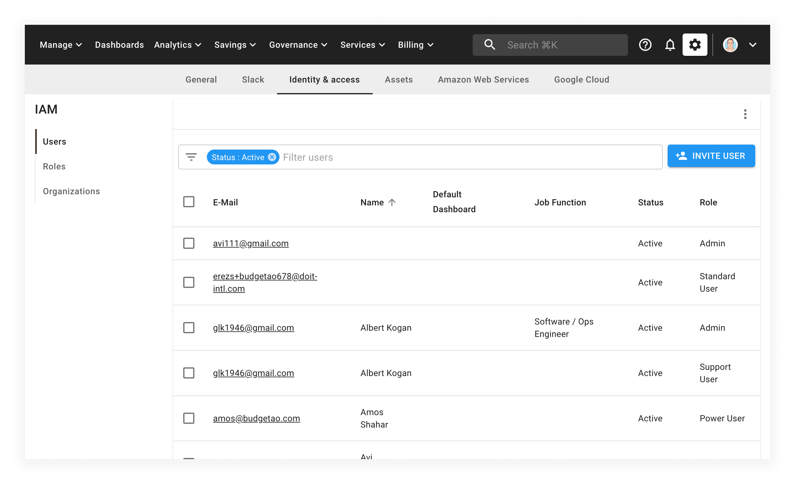
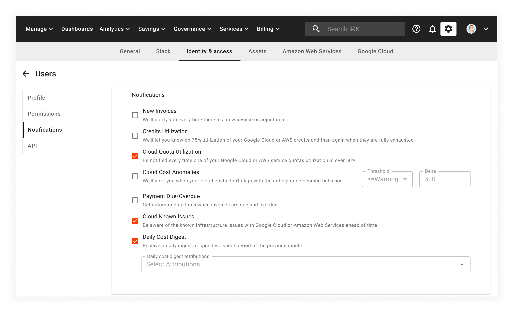

# View cost anomalies

Cloud cost anomaly detection offers end-to-end monitoring of spikes in your Google Cloud or Amazon Web Services billing across all your projects and services.

At the core of our cost anomaly detection service is our machine learning algorithm. It monitors billing data and analyzes the trend of spending in your environment. In addition, the machine learning model identifies billing patterns across many customers, forecasting your cloud spending, and constantly improving itself to provide even more accurate results.

Billing records that don't align with your anticipated spending behavior are identified for its deviation from the established patterns. You can also get insights into which resources are causing the anomalies and take corrective actions. The anomaly detection engine is always running. You can also choose email notifications for near-real-time email alerts on detected anomalies.

## Manage anomaly notifications

To manage your notifications:

1. Select the _Settings_ icon (a gear) from the top menu, and then select **Identity and access**.

   

2. Select your own user account.

3. On your user profile page, select **Notifications** from the left-hand menu.

   

To be notified of potential anomalies, select the **Cloud Cost Anomalies** checkbox, and then set the minimum severity threshold you want to be alerted on. There are three levels of severity:

- Information
- Warning
- Critical

By default, the threshold for email alerts is set to _Warning_ or higher (i.e., `>= Warning`). You can modify this setting to increase or decrease the number of alerts you receive.

:::caution

The data analysis begins as soon as you sign up. However, for anomaly detection to work properly, we need to gather at least seven full days of reference data in a specific project.

In case anomaly detection is critical to your operation, we strongly recommend you wait this _seven-day_ period out before making any significant changes to your cloud spending.

:::

## Configure custom anomaly scopes

To monitor a specific subset of costs within your accounts, you can use [attributions](../cloud-analytics/attributing-cloud-spend.mdx#edit-settings) to define a custom scope.

For example, to create anomalies to only monitor your production infrastructure, you can create an attribution to define your environment and then enable it for monitoring.

## View anomalies

We store all the detected cost anomalies. You can access them at any time by selecting **Governance** from the top menu bar, then selecting **Cost anomalies**.

### Investigate anomalies further

To dive deeper into an anomaly, select the **INVESTIGATE** button in the top right-hand corner of the screen to launch a pre-configured Cloud Analytics Report. This allows you to zoom in on a specific anomaly and determine what action (if any) is needed.

### Fine-tune alerts with direct feedback

To reduce the number of false alerts, you can provide a thumbs-up or a thumbs-down for each alert. We use this information to fine-tune the anomaly detection algorithm and improve the results.

## Watch anomaly detection video

Watch the video below for a closer look at anomaly detection:

<video
  type="loom"
  id="c5005c6d4af9468f9df0b00ca5f43655"
  thumb="-full-1606160630168.jpg"
/>
