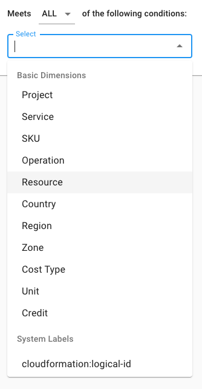
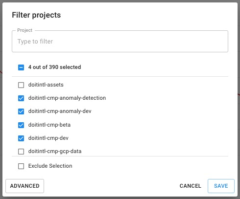
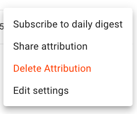
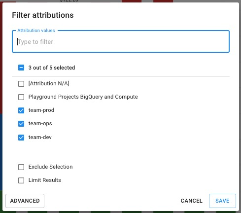

# Attribute Cloud Spend

Attributions are a flexible way to group resources and their associated costs, helping you understand the cloud costs and relate them to the business in your [Cloud Reports](https://help.doit-intl.com/cloud-analytics/create-cloud-report).

You may have various components of your application(s) spread across different projects, using different services. Attributions allow you to combine everything into something coherent.

:::note

Required Permissions: **Cloud Analytics**

:::

## Creating an Attribution

Select _Analytics_ from the top menu and then select _Attributions_ to access your attributions:

import Image from '@theme/IdealImage';

<Image
  alt="A screenshot of the Attributions screen"
  img={require('../../static/img/docs/cmp-attributions-screen.png')}
/>

To create a new attribution, select the _NEW ATTRIBUTION_ button.

Next, you will be taken to an attribution creation page, where you will configure its conditions and settings.

To start, give your Attribution a name that gives some context. In our example, we'll be creating attributions to group costs for different teams: production, dev, and ops.

If you want to give even more context to your Attribution, you may give it a description by clicking on the icon at the far-right end of the text box.

Now it's time to configure the conditions, or the criteria, which will determine what falls under your Attribution. You have the option to either set as meet "**ALL**" or "**ANY**" of the conditions. This will switch between "AND" to "OR" relations.

<Image
  alt="A screenshot showing the location of the items listed above"
  img={require('../../static/img/docs/cmp-all-any.png')}
/>

You will have every cloud billing dimension to choose from; as well as any custom, project, and system labels. Select the field(s) you'd like to include as part of your Attribution from the dropdown:

From there, filter your selections either by keyword, exclusion, or regular expression just as you would do in Cloud Analytics Reports. Continuing our example from above, let's filter for projects which the production team uses.

Finally, click "Save" to apply the filter on your condition.

Once you've set a condition, a quick preview will appear showing your attribution's costs over the last 30 days. This will continue to update as you add more conditions. This way, you can easily validate the conditions of your attribution.

Using our example from above, we will also create similar attributions for dev and ops teams.

:::note

You should **not** set multiple separate conditions with the same field &mdash; unless there is an exclusion set up in one of those conditions.

:::

## Advanced Attribution Options

Once attributions are configured you will have some additional options in the '3-dot' menu to the right of the list:

<Image
  alt="A screenshot of the attribution list with a 3-dot menu on each line"
  img={require('../../static/img/docs/cmp-attribution-list-menu.png')}
/>

As the owner of an attribution you will see several option:

### Subscribe to daily digest

Subscribing to a daily digest will send you a daily update showing you month to date cost and run rate for the scope of your attribution. &#x20;

### Share Attribution

Grant additional permissions to other users of the CMP or transfer ownership

### Delete Attribution

Remove the attribution from the CMP

### Edit Settings

In the settings panel you can enable Anomaly Detection for the scope defined by your attribution.

<Image
  alt="A screenshot of the Attributions Settings panel"
  img={require('../../static/img/docs/cmp-attributions-settings.png')}
/>

By enabling this monitor, the CMP will monitor the scope defined in your attribution for Cost anomalies.

For example, let's say you create an attribution that is filtered to a single or set of SKUs. You would be alerted to anomalies that occur only in that set of objects (as opposed to at the scope of your entire spend per cloud).

[Learn more about Cost Anomalies here](../anomaly-detection/cloud-anomalies.mdx)

## Using Attributions in Cloud Analytics Reports

Finally, once an attribution is created, you'll be able to use it your Cloud Analytics Reports by adding the Attributions chip to the break-out/group-by section, or by filtering them.

In the event that you have many attributions, make sure to click on the Attribution chip to filter the ones you want to include in your report.

In the example below, only the production, dev, and ops team attributions will be included in the report:

View the bite-sized video below for a closer look at Attributions and using them in your Cloud Reports.

import LoomEmbed from '@site/src/components/LoomEmbed';

<LoomEmbed id="8d36dbd796c84d51a26b3f836226c883" />
