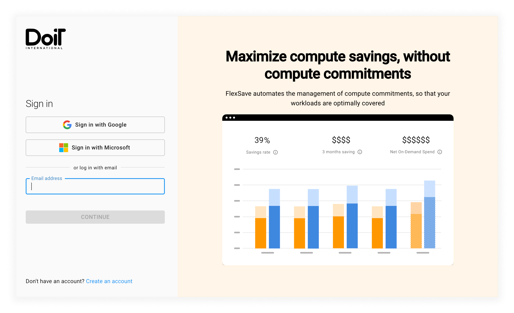

# Log in to the CMP

You can log in to the DoiT International _Cloud Management Platform_ (CMP) using one of the methods detailed below.

To log in, visit the [log-in screen](https://app.doit-intl.com/login):

## Log-in methods

### Customers

#### Use an existing Google Workspace account

<!-- textlint-disable terminology -->

Select the _SIGN IN WITH GOOGLE_ button and follow your organization's _Single Sign-On_ (SSO) instructions to log in.

<!-- textlint-enable -->

:::tip

If your organization uses Google Workspace, we recommend that your staff members use this log-in method.

By default, administrator permission isn't required to log in to the CMP for the first time on behalf of your organization (unless Google Workspace has been explicitly configured that way by an administrator).

:::

#### Use an existing Microsoft Office 365 account

Select the _SIGN IN WITH MICROSOFT_ button and follow your organization's _Single Sign-On_ (SSO) instructions to log in.

:::tip

If your organization uses Microsoft Office 365, we recommend that your staff members use this log-in method.

However, to set up access, a Microsoft Office 365 administrator must first log and grant the CMP permission to read user information for your organization.

:::

#### Use an email address and password

If you already have a CMP account, enter your email address and password to log in.

If you do not have a CMP account, you can create one by selecting _SIGN UP_ and following the instructions.

:::caution

If your organization (as determined by your email address) is already using the CMP, you can sign up without [being invited](../user-management/creating-a-new-user.mdx#inviting-new-users).

However, if you sign up without being invited, your user account will be assigned your organization's [default role](../user-management/manage-roles.mdx#setting-a-default-role) (or the [Basic Role](../user-management/manage-roles.mdx#basic-role) if no default is configured).

:::

:::tip

If you have forgotten your password, enter your email address, then select the _CONTINUE_ button. On the next screen, select _Forgot password?_ and follow the instructions to reset your password.

:::

### Partners

#### Use your Amazon or Google email address

If you work for Amazon or Google, you can log in as a partner by entering your company email address and selecting the _CONTINUE_ button.

After selecting _CONTINUE_, the CMP will send you an email with further instructions.

## FAQ

### Can I limit access to a single log-in method?

Yes, you can.

Please create a [support request](../services/consulting-support/index.mdx), tell us which log-in method your organization uses, and we will disable the other options.

### Can I use my own _Single Sign-On_ (SSO) provider?

Yes, you can.

Please create a [support request](../services/consulting-support/index.mdx), and we will configure access via your organization's _Identity Provider_ (IdP) provider.

We will need the following information:

| SAML providers | OIDC providers  |
| -------------- | --------------- |
| _Entity ID_    | _Client ID_     |
| _SSO URL_      | _Issuer (URL)_  |
| _Certificate_  | _Client Secret_ |

You can provide this information in the support request, or we can set up a configuration session with you.

:::tip

You can configure most IdPs to assign a `role_name` to anyone who signs up for a CMP account using SSO. The `role_name` is managed internally by your IdP.

When a user signs up for a CMP account, the CMP will look for an IdP `role_name` and, if found, will assign the matching [CMP Role](../user-management/manage-roles.mdx) to the user's CMP account. For this to work, the `role_name` must exactly match the name of a CMP Role.

However, if you [invite a user](../user-management/creating-a-new-user.mdx) and pre-assign a CMP Role to them, the CMP will ignore the `role_name` for that user.

:::

:::note See also

- [Google Workspace: Set up your own custom SAML application](https://support.google.com/a/answer/6087519?hl=en)
- [Okta: Get started with app integrations](https://help.okta.com/oie/en-us/Content/Topics/Apps/apps-overview-get-started.htm)

:::
