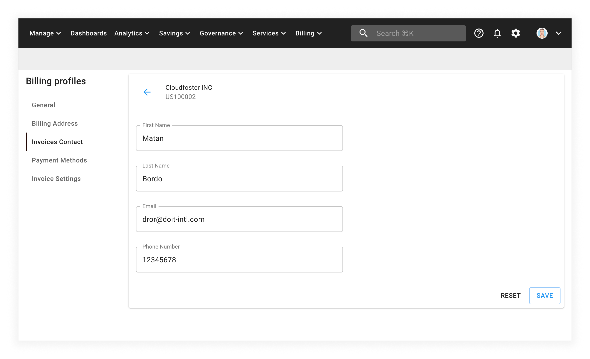

# Set Accounts Payable Contact

You can update the Accounts Payable information for your organization using the Cloud Management Platform. The information is used for billing and invoicing purposes.

:::note

Required Permissions: **Billing Profile Admin**

You must be assigned access to the specific Billing Profile under which the domain is managed in order to purchase a license.

:::

From the main CMP dashboard, select the edit icon next to the billing profile you would like to update.

From the billing profile page, select _Invoices Contact_ from the left-hand menu:

When you're finished updating your details, select the _SAVE_ button in the bottom right-hand corner of the screen.

The following video shows you how to update the AP information for a billing profile:

import LoomEmbed from '@site/src/components/LoomEmbed';

<LoomEmbed id="d4b4d1e35f65414b9d59e1290c57badb" />
