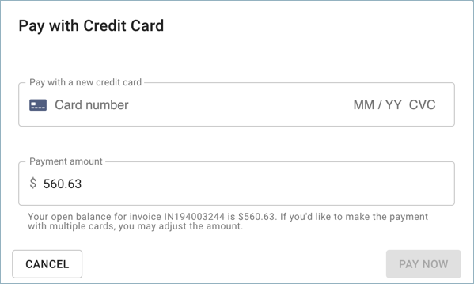
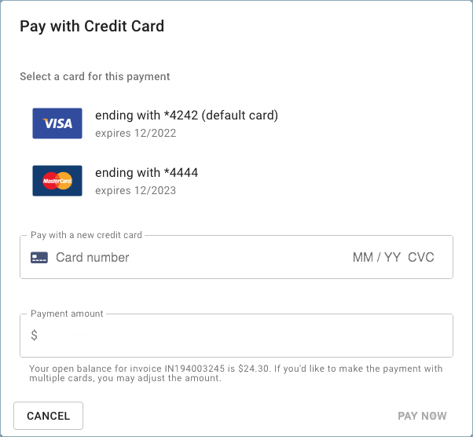

# Pay with a Credit Card or ACH

You have the option to pay the open \(i.e., unpaid\) invoices with a credit card. We process the credit cards with an emphasis on the security of the provided information.

:::note

Required Permissions: **Invoice Viewer**

You must be assigned access to the specific Billing Profile under which the domain is managed in order to purchase a license.

:::

From the main CMP dashboard, select _Billing_ from the top menu bar, then select _Invoices_.

import Image from '@theme/IdealImage';

<Image
  alt="A screenshot of the CMP dashboard"
  img={require('../assets/cmp-dashboard.png')}
/>

This action will take you to the _Invoices_ screen:

<Image
  alt="A screenshot of the _Invoices_ screen"
  img={require('../assets/cmp-invoices-screen.png')}
/>

To pay for an invoice, select the invoice from the _Invoices_ screen. On the invoice page, select the _PAY NOW_ button, located in the top right-hand corner of the page.

After selecting _PAY NOW_, a modal dialog will prompt you to enter your credit card details. If you haven't entered your credit card details in the past, you will need to do that here.

:::note

You can make a partial payment for an invoice by manually editing the amount.

:::

For customers that have already paid with a credit card in the past, the window will appear with the history of your cards that were previously used. If you see more than one credit card, please select one from the list with which you'd like to pay this invoice.

After clicking on 'Pay Now' your order transaction will begin to be processed, and once approved by the credit card processor, you will receive the following notification on the bottom left-hand corner of your page. If the payment was successful, the status of the invoice will be switched to _Paid_.

If you choose to use a different payment method, you can use Wire Transfer. The bank details can be found within the PDF of the invoice.
