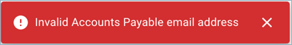
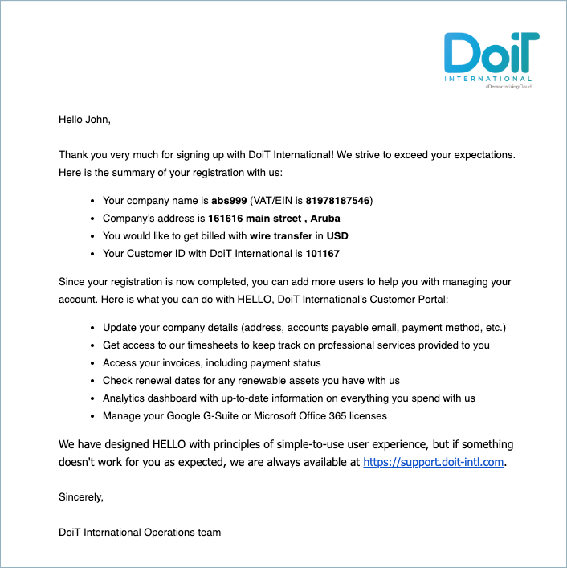

# Set up a New Billing Profile

:::note

Required Permissions: **Billing Profile Admin**

:::

From the main CMP dashboard, select the three vertical dots icon in the top right-hand corner of the screen and then select _New Billing Profile_.

import Image from '@theme/IdealImage';

<Image
  alt="A screenshot of the CMP dashboard"
  img={require('../assets/cmp-new-billing-profile-menu-item.png')}
/>

Selecting this menu item will take you to the _New Billing Profile_ page:

<Image
  alt="A screenshot showing you the _New Billing Profile_ page"
  img={require('../assets/cmp-new-billing-profile-screen.png')}
/>

From this screen, you can proceed to fill out the the details of your new billing profile.

After completing all the required fields in each section, you will be asked what payment method you'd like to use: Credit Card, Bill.com, Wire Transfer, or ACH Payment.

Select the _SUBMIT_ button when you have completed the form.

:::info

If you receive the following error, please try again:

:::

After the successful submission of a new billing profile, an automatic email notification will be sent to the email address placed in the billing profile details. Here is an example:

At the beginning of the month, you will receive an invoice for the New billing profile you registered for services used in the previous month.

The new billing profile will now be visible in your dashboard.
