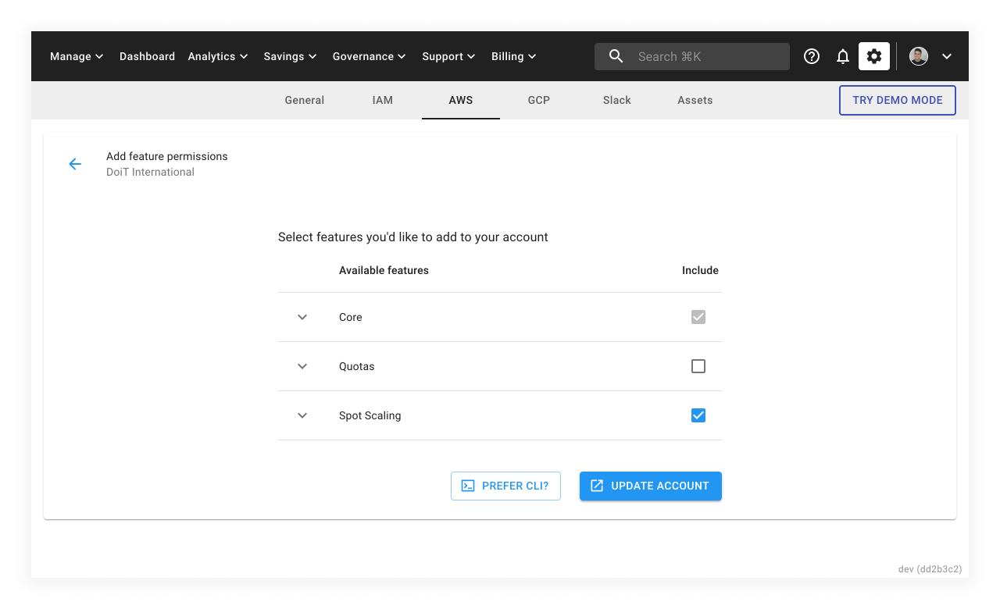
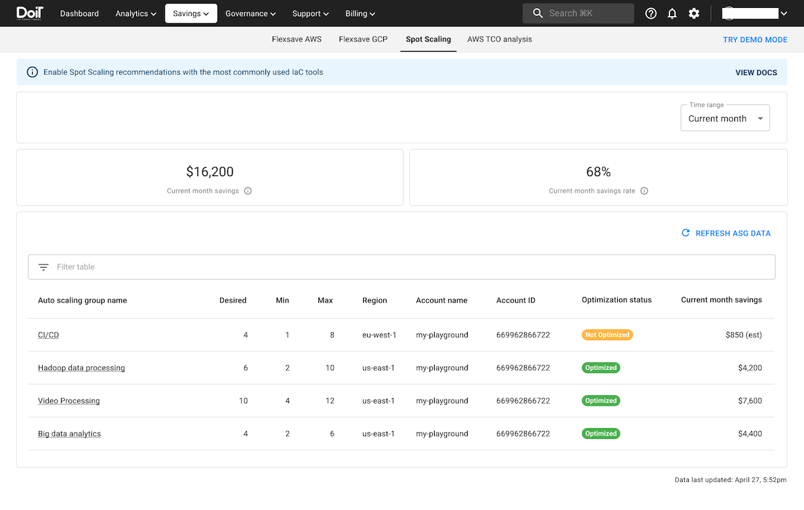
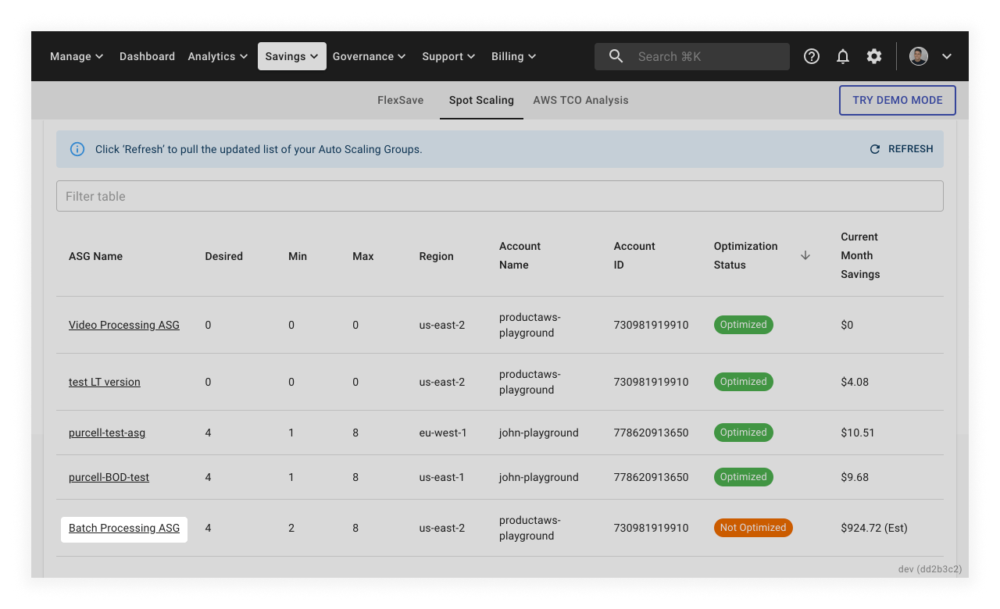
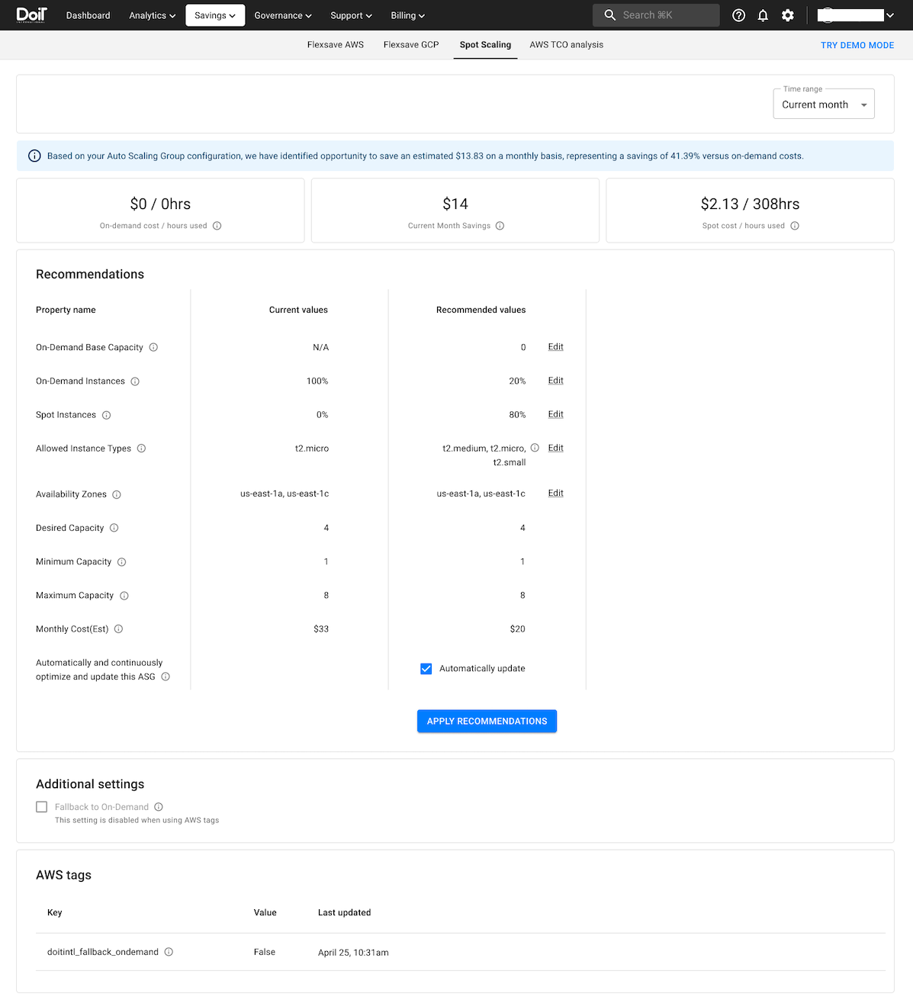

# Setting up Spot Scaling

## Connect your AWS account

To use Spot Scaling, you must provide access to your AWS account to the CMP.

If your account is not linked already, follow the instructions of [linking your AWS account](https://help.doit-intl.com/amazon-web-services/add-your-amazon-web-services-iam-role).

You also need to create an AWS IAM role and attach an IAM Policy with a requisite set of permissions. These permissions allow Spot Scaling to monitor your ASG behavior and make spot instance recommendations; they also allow you to implement the recommendations. Refer to [creating new policies: Spot Scaling](https://help.doit-intl.com/amazon-web-services/add-your-amazon-web-services-iam-role#spot-scaling) for details about the requisite permissions.

### Add Spot Scaling to your account

Once the account is linked, you need to update the role attached to your account with additional permissions for Spot Scaling by [adding a feature](https://help.doit-intl.com/amazon-web-services/add-your-amazon-web-services-iam-role#adding-a-feature).

Make sure to select the checkbox of _Spot Scaling_, as shown below.

## Spot Scaling Recommendations via CMP

You can check the recommendations, modify them as needed, and apply the recommendations in the CMP.

### View Recommendations

Open the Spot Scaling page under _Savings_ in the top navigation.

Auto Scaling Groups (ASGs) associated with the linked AWS account will appear on your Spot Scaling page. ASGs not optimized will have a value of `Not Optimized` under the _Optimization Status_ column.

Select an ASG to view its Spot Scaling recommendations.

### Modify Recommendations

For an un-optimized ASG, you'll see the following:

- _Current Values_ &mdash; the ASG's current configuration
- _Recommended Values_ &mdash; Spot Scaling's recommendations

You'll also find the current on-demand costs and hours running for that ASG in the upper-left corner

You can adjust the recommendations to your needs. You may modify the following values:

- On-Demand Base Capacity
- On-Demand Instances
- Spot Instances
- Allowed Instance Types
- Availability Zones

To edit the values of _Allowed Instance Types_ and _Availability Zones_, select the corresponding _EDIT_ button. Select _UPDATE_ when you've made your changes.

### Apply Recommendations

To reconfigure your ASG according to Spot Scaling's recommendations, select _APPLY RECOMMENDATIONS_.

Once you've applied the recommendation, the _Recommended Values_ column will disappear, the values under the _Current Values_ column will be updated to reflect the changes, and the metrics displayed at the top will show the actual cost/hour breakdowns for on-demand and Spot, as well as the actual savings.

You can adjust the time range for which the metrics are displayed by selecting the _Time Range_ dropdown in the upper-right corner.

After applying the recommendation, your ASG will have a value of `Optimized` under the _Optimization Status_ column.

### General Settings

Spot Scaling provides two optional features:

- _Keep my ASG up to date_ &mdash; If selected, Spot Scaling will automatically update the ASG's configuration to continuously maximize system runtime and spot-related EC2 savings.
- _Fallback to On-Demand_ &mdash; If selected, when there are not enough EC2 instances available to meet the capacity demand for Spot instances, Spot Scaling will automatically fall back to on-demand instances.

## Spot Scaling auto-enrollment

Spot Scaling auto-enrollment is a tool-agnostic solution that allows you to implement Spot Scaling recommendations using Infrastructure as Code (IaC) tools, for example, Terraform and AWS CloudFormation, instead of having to log in to the CMP.

Spot Scaling auto-enrollment is ideal for DevOps or Platforms teams who prefer using IaC tools to deploy and maintain their cloud infrastructure.

### Enable Spot Scaling auto-enrollment via AWS ASG tags

Spot Scaling auto-enrollment leverages AWS ASG tags.

To enable auto-enrollment, use the following tags when creating your ASGs:

- Tag to apply Spot Scaling recommendations:

  - _Key_: `doitintl:spotscaling:auto-enroll`
  - _Value_:
    - `Always`: Allows Spot Scaling to apply continuous recommendations by finding new savings opportunities when AWS modifies/updates their pricing for the spot market or when new resources are updated or released.
    - `Never`: Stops Spot Scaling from applying recommendations.

- Tag to enable fallback to on-demand:

  - _Key_: `doitintl:fallback-to-on-demand`
  - _Value_:
    - `True`: When there are not enough EC2 instances available to meet the capacity demand for Spot instances, Spot Scaling will automatically fall back to on-demand instances.
    - `False`: Spot Scaling will not fall back to on-demand instances in case of [Spot Instance interruptions](https://docs.aws.amazon.com/AWSEC2/latest/UserGuide/spot-interruptions.html).

:::info

The current implementation of auto-enrollment only allows the two tags mentioned above. Recommendations will be made based on 20% of desired capacity exists on-demand and 80% with spot instances. For the allowed instance type, the recommendations are similar machine types based on vCPUs and memory configuration.

To adjust the recommendations, you need to log in to the CMP to [Modify Recommendations](#modify-recommendations).
:::
